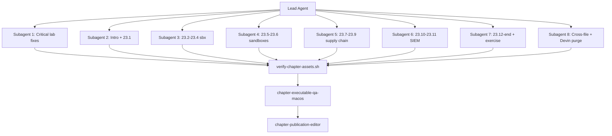

# Chapter 23 — Comprehensive Fix Plan

**Goal:** Resolve every finding from the full-chapter review (Critical → Low), remove **Devin** as a coding agent throughout the book, and ship a publication-ready Chapter 23.

**Branch:** `cursor/chapter-23-fixes-5d2f` (off current `cursor/chapter-publication-review-5d2f` or `main` + Ch 23)

**Verification gates:**
1. `./scripts/verify-chapter-assets.sh ebook/part3_real_world_projects/23_secure_agentic_ai_development_on_macos.md` — zero blockers
2. `npm run lint` — pass
3. `/chapter-executable-qa-macos` — readonly audit, `macos-live` on Sammy's Mac
4. `/chapter-publication-editor` — final scorecard, Overall ≥ 4.5, zero blockers

---

## Subagent orchestration



| Subagent | Scope | Files | Est. edits |
|----------|-------|-------|------------|
| **SA-1 Critical** | Executable blockers | Ch 23 labs, osquery SQL, OTel vocabulary | ~25 lines |
| **SA-2 Intro** | LO1, jargon, intro polish | L1–162 | ~40 lines |
| **SA-3 sbx** | §23.2–23.4 labs + LO3 | L163–494 | ~80 lines |
| **SA-4 Native** | §23.5–23.6 + Cursor rules | L495–997 | ~120 lines |
| **SA-5 Supply** | §23.7–23.9 + plugins/skills | L998–1139 | ~100 lines |
| **SA-6 Fleet** | §23.10–23.11 + yaml | L1140–1476, `otel-collector-agents.yaml` | ~90 lines |
| **SA-7 Capstone** | §23.12–end, exercise, refs | L1477–1652 | ~70 lines |
| **SA-8 Cross-file** | Devin removal, CHANGELOG, cspell | 6 files | ~30 lines |
| **SA-9 QA** | readonly executable audit | — | report only |
| **SA-10 Publish** | readonly + fix remaining | Ch 23 + integration | scorecard |

---

## Phase 0 — Setup (Lead Agent)

- [ ] `git checkout -b cursor/chapter-23-fixes-5d2f`
- [ ] Confirm base includes Ch 23 + subagents from PR #2
- [ ] Create shared constants block for labs (paste into §23.3 once):

```bash
# Use a stable sandbox name for all Chapter 23 sbx labs
export SBX_LAB_NAME="secure-bash-agent-lab"
# Helper: resolve sandbox name (works with sbx ls header row)
sbx_lab_name() {
  sbx ls 2>/dev/null | awk 'NR>1 && $1 !~ /^SANDBOX$/ {print $1; exit}'
}
```

- [ ] Add helper to `scripts/verify-chapter-assets.sh` if labs adopt `--name "$SBX_LAB_NAME"`

---

## Phase 1 — CRITICAL (SA-1)

### 1.1 Fix `sbx ls` parsing (BLOCKER)

**Problem:** `awk 'NR==1{print $1}'` returns header `SANDBOX`.

**Fix strategy:** Standardize on named sandboxes + helper function.

| Line | Current | Replace with |
|------|---------|--------------|
| 412 | `awk 'NR==1{print $1}'` | `sbx run --name "$SBX_LAB_NAME" claude -- "$AGENT_LAB"` in Lab A setup; then `sbx exec -it "$SBX_LAB_NAME" bash -c '...'` |
| 425–426 | `SANDBOX=$(sbx ls ... awk NR==1)` | `SANDBOX="${SBX_LAB_NAME:-$(sbx_lab_name)}"` |
| 450, 457, 482 | same pattern | `"$SBX_LAB_NAME"` or `sbx_lab_name` |

**Lab A rewrite steps:**
1. Add `--name "$SBX_LAB_NAME"` to first `sbx run claude` (line ~400)
2. Replace all dynamic name resolution with `"$SBX_LAB_NAME"`
3. Update verify: "`sbx ls` shows row with SANDBOX column `$SBX_LAB_NAME`"

### 1.2 Fix lab cross-references (BLOCKER for flow)

| Line | Fix |
|------|-----|
| 284 | `Install Claude Code for Labs A–D (sbx)` |
| 285 | `Install Cursor CLI for Lab E (§23.5)` |
| 302 | `preview of Lab H in §23.6` |

### 1.3 Fix osquery table name (BLOCKER)

| Line | Fix |
|------|-----|
| 1157 | `FROM es_process_events` |
| 1390 | `es_process_events` |

Align with Ch 18 and `osquery-agentic-ai-pack.json`.

### 1.4 Fix Claude reject vs deny (BLOCKER)

| Line | Fix |
|------|-----|
| 1179 | `Claude decision=reject or Codex decision=deny` |
| 1473 | `decision=reject` (Claude) or `decision=deny` (Codex); note agent-specific |

---

## Phase 2 — HIGH (SA-2 through SA-8)

### SA-2: Intro + §23.1 (L1–162)

| ID | Line(s) | Action |
|----|---------|--------|
| H-01 | 108 | Fix grammar: "an allowed egress channel" |
| H-02 | 18 | Expand **MCP** on first use: "Model Context Protocol (MCP) servers" |
| H-03 | 22 | Expand **mSCP** and **PPPC**; soften Seatbelt back-ref: "builds on sandbox concepts from Chapters 10–11" |
| H-04 | 8–9, 43 | One-line **sbx** definition: "Docker Sandboxes (`sbx`) — microVM CLI on Apple Silicon" |
| H-05 | 48, 61 | One sentence on hooks: "PreToolUse / beforeShellExecution intercept tool calls before they run" |
| H-06 | 87–98 | Add **direct injection example** (chat prompt) and **indirect example** (README with hidden instructions) — 4–6 lines each in fenced blocks |
| H-07 | 96 | Define **agent skills**: "packaged instruction bundles (SKILL.md) that agents load as tools" |
| H-08 | 13, 998 | Add **plugins** one-liner in LO context: "IDE/agent plugins extend capabilities; vet like MCP" |
| H-09 | 155–161 | Add rows: **Cursor**, **GitHub Copilot CLI**, **OpenCode** to danger-zones table |
| H-10 | 161–175 | **Remove Devin Local** row from danger-zones and isolation table |
| H-11 | 134 | Rename to "Scenario walkthrough" (drop "book-original") |
| H-12 | 77–79 | Bridge sentence before §23.1: "The patterns above inform the threat model below." |
| H-13 | 161–163 | Forward pointer: "§23.2 compares isolation options systematically." |

**Devin removal in this block:** L10, L18, L161, L175.

**LO4 LO edit (L10):** Change to:
> Configure **native sandboxes** per agent (Cursor, Claude Code, Codex CLI) including `sandbox.json` (Cursor) and product-specific equivalents.

---

### SA-3: §23.2–23.4 (L163–494)

| ID | Action |
|----|--------|
| H-14 | Remove Devin row from isolation table L175 |
| H-15 | Add forward pointer at end of §23.4: "Native Seatbelt comparison continues in Lab G (§23.5)." |
| H-16 | Document **network policy choice** at first `sbx login` (Open / Balanced / Locked Down); note Lab B requires Balanced or Locked Down |
| H-17 | Move **Lab D auth** note into §23.3 prerequisites: "Complete `sbx login` and choose network policy before Lab A" |
| H-18 | Require `claude` for Labs A–D (not optional) in Step 2 |
| H-19 | Add one **multi-agent LO3** line after Lab A: `sbx run --name "$SBX_LAB_NAME-codex" codex -- "$AGENT_LAB"` (optional stretch in lab) |
| H-20 | Lab C: uncomment/complete `git fetch sandbox-<name>` validation steps L464–468 |
| H-21 | Lab D: add concrete pass/fail for secrets (document expected empty grep + pointer to proxy docs) |
| H-22 | §23.2: add 2-sentence prose on **why Docker-in-container** row is risky |
| H-23 | Map isolation table rows to decision tree (56–65) — add callout box |
| H-24 | `brew trust docker/tap` note alongside tap install L215–216 |
| H-25 | Step 3: state "run from ebook repo root" for asset script path |
| H-26 | Step 4 scaffold: use `$AGENT_LAB` path not `/path/to/secure-bash-macos-ebook` |

---

### SA-4: §23.5–23.6 (L495–997)

| ID | Action |
|----|--------|
| H-27 | **Remove entire Devin subsection** L684; rename heading L680 to `### OpenCode and Aider` |
| H-28 | Remove Devin from maturity matrix L862; remove from sbx defaults table if present |
| H-29 | LO4 footnote after L507: "`sandbox.json` is Cursor-specific; Claude uses `settings.json`, Codex uses `config.toml`." |
| H-30 | §527 Claude: add sandbox enable snippet (`@anthropic-ai/sandbox-runtime` or settings.json `sandbox` block) |
| H-31 | Add **`.cursor/rules/security.mdc` example** with frontmatter (`description`, `globs`, `alwaysApply`) in §805–807 |
| H-32 | Lab E: inline `.cursor/sandbox.json` JSON (copy from L509–516) in lab steps L702+ |
| H-33 | Lab H layout L983–996: add `.cursor/rules/`, `.mcp/allowlist.json`; unify asset paths to `ebook/assets/...` |
| H-34 | Lab H checklist: add commits for `sandbox.json`, `.mdc` rule, MCP allowlist |
| H-35 | Lab G table: add Codex `workspace-write` column footnote; add Copilot "advisory only" row |
| H-36 | Expand Lab F: add negative test template ("which layer blocked: Seatbelt vs permission prompt") |
| H-37 | §23.6: add minimal `.codex/hooks.json` example (5–10 lines) |
| H-38 | Move enforcement ladder L769–781 **before Lab E** OR add forward pointer at L688 |
| H-39 | Deduplicate MCP/file-read warning L521–523 (keep one strong paragraph) |
| H-40 | Rename "Devin Desktop" references → remove |

---

### SA-5: §23.7–23.9 (L998–1139)

| ID | Action |
|----|--------|
| H-41 | §23.7 title → include **plugins**: "Skills, MCP Servers, Plugins, and the Supply Chain" |
| H-42 | New subsection **Plugins (IDE/agent extensions)**: definition, attack patterns (malicious extension updates), vetting checklist — mirror MCP structure |
| H-43 | New subsection **Skills vetting**: registry signing, diff review, pin versions, SKILL.md review checklist (don't defer all to 23.12) |
| H-44 | Add fictional `.cursor/mcp.json` snippet for tabletop `exfil-helper` PR L1056 |
| H-45 | Add **`beforeMCPExecution` hook example** with `failClosed: true` (Cursor format) — new asset or inline |
| H-46 | Clarify `.mcp/allowlist.json`: organizational convention + hooks/review; not native product enforcement unless hook present |
| H-47 | **Lab I rewrite:** Step 5: stdin test hook deny on undeclared MCP; OR retitle to "MCP allowlist tabletop and hook test" |
| H-48 | **Lab J:** implement version check:

```bash
if [[ -n "${SBX_VERSION_REQUIRED:-}" ]]; then
  actual="$(sbx version 2>/dev/null | head -1)"
  # compare major.minor per your policy
fi
```

| H-49 | Lab J: add **Danger zone** callout before `sudo tee /etc/profile.d/` |
| H-50 | §23.8: bridge from §23.7: "After vetting extensions, default to guardrails..."; cross-ref Lab H |
| H-51 | §23.8: expand "four patterns" (identity, device trust, least privilege, audit) — 1 sentence each |
| H-52 | §23.9: add **MDM stub** — comment block showing Jamf script parameter or managed-settings path for Cursor hooks |
| H-53 | Patterns 1–3 (alias, shim, repo helper): add minimal code for at least pattern 1 (alias) |

---

### SA-6: §23.10–23.11 (L1140–1476)

| ID | Action |
|----|--------|
| H-54 | **Remove Devin** from Santa allowlist L1146 |
| H-55 | New §23.10 subsection **MDM fleet deployment**: Santa profile via MDM, osquery pack push, Claude managed-settings payload path (cross-ref Ch 14) |
| H-56 | Add **Santa → SIEM** snippet: `filelog` or forward `santactl printlog` pattern; cross-ref Ch 21 |
| H-57 | Lab L: validate using pack query `agent_lotl_chain` not just ad-hoc SELECT |
| H-58 | `otel-collector-agents.yaml`: add commented **datadog** exporter stanza |
| H-59 | `otel-collector-agents.yaml`: add commented **azuremonitor / Sentinel** stanza with DCR note |
| H-60 | §23.11: 3-sentence walkthrough enabling Splunk or Elastic exporter from yaml |
| H-61 | Lab M Step 6 (new): "Enable one backend exporter (commented in sample yaml)" — optional |
| H-62 | Clarify osquery → SIEM path: Ch 18 forwarder vs OTLP (architecture note L1243–1250) |
| H-63 | Managed settings L1266–1280: add "Deploy via MDM custom settings payload" sentence |

---

### SA-7: §23.12–end (L1477–1652)

| ID | Action |
|----|--------|
| H-64 | **Exercise Phase 0 or 3.6:** Indirect injection tabletop (Makefile/README scenario from L1520–1525) |
| H-65 | Add **Phase 3.5:** Lab I (MCP hook test + four-point vetting checklist) |
| H-66 | Add **Phase 3.6 or 4.0:** Lab J (MDM pin + version check verify) |
| H-67 | Add **Phase 2.3:** Lab F (Claude Seatbelt smoke) between 2.2 and 2.4 |
| H-68 | Deduplicate Phase 4.4 and 5.6 IR drill — keep in Phase 5 only; Phase 4.4 → "osquery row timestamp recorded" |
| H-69 | Phase 1: add explicit **Lab D** step (sbx secret) between 1.3 and 1.4 |
| H-70 | Mandatory **Phase 6 — Governance** (or promote Stretch): classification tier mapping + break-glass one-pager |
| H-71 | §23.13: add troubleshooting rows — hook JSON failures, Codex Statsig default, MCP connection, `--clone` disk/RAM |
| H-72 | §23.13: move fleet pin sentence from L1545 into table row |
| H-73 | References: add URLs for OWASP LLM Top 10, NIST AI RMF, OTel GenAI conventions |
| H-74 | References: remove Devin L1648 |
| H-75 | Offline labs note L1612: table which phases need Apple Silicon vs API keys |

---

### SA-8: Cross-file Devin purge + integration

| File | Action |
|------|--------|
| `23_secure_agentic_ai_development_on_macos.md` | All Devin refs (grep confirmed 9 locations) |
| `CHANGELOG.md` L12 | Remove "Devin Local" from Ch 23 summary |
| `cspell.json` | Remove "Devin" if no longer used |
| `00_part3_real_world_projects.md` | Verify Ch 23 bullet has no Devin |
| `about.md` | No Devin expected |
| `103_D_further_reading_and_communities.md` | Check for Devin links |
| `.cursor/rules/ebook-authoring.mdc` | No change needed |

**Optional new asset:** `ebook/assets/scripts/cursor-before-mcp-guard.sh` for Lab I hook test (if not inline only).

---

## Phase 3 — MEDIUM (fold into subagents above)

| ID | Action | Owner |
|----|--------|-------|
| M-01 | Consistent chapter refs: "Chapter N" not "Ch N" | SA-2, SA-7 |
| M-02 | OTel before OpenTelemetry on first body use L36/51 | SA-2 |
| M-03 | Failure modes header "actor × capability × risk" | SA-2 |
| M-04 | Lab A verify: add explicit `pwd` command in sandbox | SA-3 |
| M-05 | Phase 1 cleanup aligns with Lab C `sbx rm` | SA-3 |
| M-06 | OpenCode sbx agent line in supported agents table L327 | SA-3 |
| M-07 | Sample repo `docs/security.md` vs `security-agent-policy.md` align L787/995 | SA-4 |
| M-08 | Copilot hooks JSON example in §23.6 | SA-4 |
| M-09 | MCP SSH Orchestrator 5-line YAML inline L1028 | SA-5 |
| M-10 | Lab I red-team prompt cross-ref Lab H hooks | SA-5 |
| M-11 | EDR row in 23.10 cross-ref generic | SA-6 |
| M-12 | Lab M cross-ref "see §23.11 Labs M/N" in exercise Phase 5 | SA-7 |
| M-13 | Stretch bonus mentions Datadog/Sentinel stanzas after yaml update | SA-6 |
| M-14 | `agent-lab-scaffold.sh` add `.mdc` placeholder if scaffold creates repo | SA-4 + asset |

---

## Phase 4 — LOW (fold into subagents)

| ID | Action |
|----|--------|
| L-01 | Redundant brew install lines L210 vs 215 — consolidate |
| L-02 | Lab time estimates note (50 min total for A–D) |
| L-03 | `sbx ls -q` footnote — verify or remove L426 |
| L-04 | Matrix add OpenCode to guardrail maturity L856–863 |
| L-05 | References cite `otel-collector-agents.yaml` path |
| L-06 | `@AGENTS.md` placement note in §23.6 only (minor) |
| L-07 | Lab G footnote polish |
| L-08 | Regulated tier vs Stretch Xcode exception clarify L1486/1607 |

---

## Phase 5 — Script & subagent updates (Lead Agent)

### 5.1 `scripts/verify-chapter-assets.sh`

- [ ] Add check: no `Devin` in chapter (optional grep blocker if user requested removal)
- [ ] Add check: no `awk 'NR==1{print $1}'` on `sbx ls` in chapter
- [ ] Add check: no `FROM process_events` without `es_` prefix in Ch 23 osquery blocks

### 5.2 Subagent prompt tweaks (if needed)

- [ ] `chapter-publication-editor.md`: add "Chapter 23 must not reference Devin"
- [ ] `chapter-executable-qa-macos.md`: add sbx lab name pattern to checklist

---

## Phase 6 — Execution order (parallel batches)

**Batch 1 (parallel, no file conflicts):**
- SA-1 Critical → commit `fix(ch23): critical lab and SQL fixes`
- SA-8 Devin purge in CHANGELOG/cspell → commit `chore: remove Devin references`

**Batch 2 (parallel, section splits):**
- SA-2 Intro + 23.1
- SA-3 23.2–23.4
- SA-5 23.7–23.9
- SA-6 23.10–23.11 + yaml

**Batch 3 (depends on Batch 2):**
- SA-4 23.5–23.6 (may touch same tables SA-2 edited for Devin)
- SA-7 23.12–end (exercise must reference fixed lab letters)

**Batch 4 (integration):**
- Lead merges conflicts
- Run `verify-chapter-assets.sh` + `npm run lint`
- Commit `fix(ch23): comprehensive publication polish`

**Batch 5 (QA gates):**
- SA-9: `/chapter-executable-qa-macos` full chapter — paste findings
- SA-10: `/chapter-publication-editor` — fix any remaining blockers, produce scorecard

**Batch 6 (Mac-only, Sammy):**
- Re-run verify script `macos-live`
- Clear REQUIRES-MACOS-RUNNER items
- Update PR description with final scorecard

---

## Phase 7 — Final publication scorecard (target)

| Dimension | Target |
|-----------|--------|
| All 8 LOs | Explicitly covered + exercise validates each |
| Devin | Zero references |
| Executable accuracy | 5/5 after Mac re-run |
| macOS portability | 5/5 |
| Reader voice | 5/5 |
| **Overall** | **≥ 4.8/5** |

### Exercise ↔ LO validation matrix (after fixes)

| LO | Exercise phase |
|----|----------------|
| LO1 | Phase 0 or 3.6 — indirect injection tabletop |
| LO2 | Phase 2.4 — Lab G comparison |
| LO3 | Phase 1 — Labs A–D (+ optional codex) |
| LO4 | Phase 2.2–2.3 — Labs E, F |
| LO5 | Phase 5 — Labs M–N |
| LO6 | Phase 3 — Lab H |
| LO7 | Phase 3.5 — Lab I |
| LO8 | Phase 4 — Labs K–L; Phase 3.6 — Lab J |

---

## PR strategy

1. **Update PR #2** on branch `cursor/chapter-23-fixes-5d2f` OR push to existing `cursor/chapter-publication-review-5d2f`
2. **Close PR #1** if still open (superseded)
3. PR title: `Chapter 23: comprehensive publication fixes and Devin removal`
4. PR body: checklist of all phases + final scorecard + Mac follow-up items

---

## Risk notes

- **Scope:** ~500 line edits across 1,652-line chapter — use section subagents to avoid merge conflicts
- **sbx CLI drift:** Pin examples to `--name` pattern; avoid fragile parsing
- **Devin removal:** Replace matrix rows with OpenCode or Copilot CLI where column balance needed
- **New hook asset:** If adding `cursor-before-mcp-guard.sh`, update verify script fixtures

---

## Approval checklist (for Sammy)

- [ ] Approve Devin removal everywhere (including CHANGELOG)
- [ ] Approve new Phase 0/6 exercise steps (adds ~30 min lab time)
- [ ] Approve optional Datadog/Sentinel yaml stanzas (commented)
- [ ] Confirm execute on Mac after Cloud Agent merge

**Ready to execute:** Say "implement the Chapter 23 fix plan" and lead agent will launch SA-1 through SA-10 in batch order.
