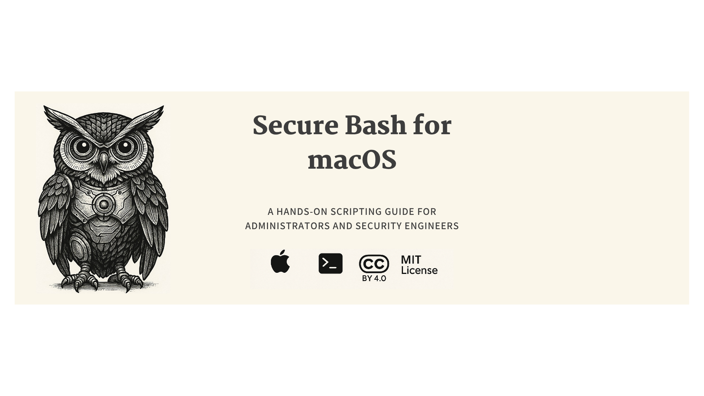

<div align="center">
  
</div>

# Secure Bash for macOS

> **A practical, hands-on scripting guide for administrators and security engineers who want to master Bash on macOS**

[](https://github.com/samerfarida/secure-bash-macos-ebook/releases/latest/download/Secure-Bash-for-macOS-v0.14.0.pdf)
[](https://github.com/samerfarida/secure-bash-macos-ebook/releases/latest/download/Secure-Bash-for-macOS-v0.14.0.epub)
[](https://github.com/samerfarida/secure-bash-macos-ebook/releases/latest/download/Secure-Bash-for-macOS-v0.14.0.html)
[](https://creativecommons.org/licenses/by/4.0/)
[](https://opensource.org/licenses/MIT)

**Master Bash scripting on macOS, from fundamentals to enterprise automation.**

This comprehensive ebook teaches you how to write secure, efficient Bash scripts specifically tailored for macOS. Whether you're an IT administrator managing thousands of devices, a security engineer hardening endpoints, or a power user automating your workflow, this book provides practical, real-world examples you can use immediately.

## What You'll Learn

### Part I – Bash Fundamentals
- **Chapters 1-5:** Master the basics of Bash on macOS
- Navigate the Terminal, understand Bash syntax, manipulate files, process data, and manage system resources
- Build a solid foundation with practical examples tailored for macOS

### Part II – Advanced Security Scripting
- **Chapters 6-13:** Level up your scripting skills
- Write resilient scripts with proper error handling
- Integrate with macOS internals (launchd, SIP, PPPC)
- Create secure, auditable automation
- Build interactive GUI-driven tools with osascript, swiftDialog, and Platypus

### Part III – Real-World Projects
- **Chapters 14-22:** Enterprise-grade automation you can deploy today
- Automated hardening & compliance with mSCP
- Application deployment with Installomator & Patchomator
- Endpoint monitoring with osquery
- Patch automation and notifications
- Application control with Santa
- Privilege elevation with SAP Privileges
- And much more!

## Why This Book?

- **Written by a Security Architect** with over a decade of experience in IT and extensive focus on cybersecurity
- **Enterprise-Tested** examples proven in production at scale
- **Security-First** mindset built into every lesson
- **macOS-Specific** tips, tricks, and gotchas throughout
- **Hands-On** exercises and real-world use cases
- **Up-to-Date** with the latest macOS features and best practices

## Quick Start

### Download the Latest Release

```bash
# Download PDF
curl -L https://github.com/samerfarida/secure-bash-macos-ebook/releases/latest/download/Secure-Bash-for-macOS-v0.14.0.pdf \
  -o Secure-Bash-for-macOS.pdf

# Download EPUB
curl -L https://github.com/samerfarida/secure-bash-macos-ebook/releases/latest/download/Secure-Bash-for-macOS-v0.14.0.epub \
  -o Secure-Bash-for-macOS.epub

# Download HTML
curl -L https://github.com/samerfarida/secure-bash-macos-ebook/releases/latest/download/Secure-Bash-for-macOS-v0.14.0.html \
  -o Secure-Bash-for-macOS.html
```

### Build from Source

```bash
# Clone the repository
git clone https://github.com/samerfarida/secure-bash-macos-ebook.git
cd secure-bash-macos-ebook

# Build PDF
make pdf

# Build EPUB
make epub

# Build HTML
make html
```

**Requirements:** macOS with Pandoc installed (`brew install pandoc`)

## Table of Contents

**Part I – Bash Fundamentals**
1. Getting Started with Bash on macOS
2. Bash Syntax and Command Structure
3. File System Navigation and Manipulation
4. Text Processing and Data Manipulation
5. Working with Processes and System Resources

**Part II – Advanced Security Scripting**
6. Control Structures and Functions
7. File Management and Permissions
8. Error Handling and Debugging
9. Environment Variables and Configuration
10. macOS Internals for Scripting
11. Security Practices in Bash
12. Interfacing with macOS APIs and Tools
13. Writing Interactive and GUI-Driven Scripts

**Part III – Real-World Projects**
14. Automated Hardening & Compliance (mSCP)
15. Inventory & Asset Management
16. Signed & Notarized Installer Packages
17. Reprovisioning & OS Refresh
18. Endpoint Monitoring & Threat Detection
19. macOS Patch Automation & Notifications
20. Application Deployment & Update Automation
21. Application Control with Santa
22. Privilege Elevation with SAP Privileges

## Who Is This Book For?

This book is perfect for:

- **macOS Administrators** managing fleets of devices
- **Security Engineers** hardening endpoints and building detection
- **DevOps Engineers** automating infrastructure and deployments
- **Power Users** who want to master the macOS command line
- **Anyone** who writes Bash scripts and wants to do it securely

**Prerequisites:**
- Basic familiarity with the Terminal
- Access to a Mac running macOS
- Willingness to learn and experiment

## Contribute

This project thrives on community involvement! Here's how you can help:

### Star the Repository
Show your support by starring this repo—it helps others discover the book.

### Report Issues
Found a typo, bug, or have a suggestion? Open an issue!

### Suggest Improvements
Have ideas for new examples, chapters, or features? We'd love to hear them.

### Contribute Content
Want to add examples, fix errors, or improve chapters?

1. Fork the repository
2. Create a feature branch (`git checkout -b feature/your-improvement`)
3. Make your changes
4. Submit a pull request with a clear description

All contributors will be recognized in future releases!

### Review Process
Your pull request will be reviewed, and once merged, we'll automatically acknowledge your contribution in the next release.

## License

This ebook is released under a **dual-license** model:

- **Book Content** (Markdown files): [Creative Commons Attribution 4.0 International (CC BY 4.0)](https://creativecommons.org/licenses/by/4.0/)
  - You can copy, redistribute, remix, transform, and build upon the content
  - Credit the author and provide a link to the license

- **Scripts & Code** (Makefile, build scripts, CI): [MIT License](https://opensource.org/licenses/MIT)
  - Free to use, modify, and distribute

## Acknowledgments

Special thanks to all the reviewers, contributors, and community members who provided feedback, tested scripts, and made this project better. Your contributions are invaluable, and you'll be recognized in each release.

Want to see your name here? [Join the community!](https://github.com/samerfarida/secure-bash-macos-ebook#contribute)

## Connect

- **Author:** [Sammy Farida](https://github.com/samerfarida)
- **Email:** samer.farida@yahoo.com
- **GitHub:** [@samerfarida](https://github.com/samerfarida)

## Show Your Support

If you find this book helpful:

- **Star** the repository
- **Bookmark** it for later
- **Share** it with colleagues
- **Report** issues or suggest improvements
- **Join** discussions in the Issues section

---

**Ready to master Bash on macOS?**

- [Download PDF](https://github.com/samerfarida/secure-bash-macos-ebook/releases/latest/download/Secure-Bash-for-macOS-v0.14.0.pdf)
- [Download EPUB](https://github.com/samerfarida/secure-bash-macos-ebook/releases/latest/download/Secure-Bash-for-macOS-v0.14.0.epub)
- [Download HTML](https://github.com/samerfarida/secure-bash-macos-ebook/releases/latest/download/Secure-Bash-for-macOS-v0.14.0.html)
- [View All Releases](https://github.com/samerfarida/secure-bash-macos-ebook/releases)

Made with care for the macOS security and admin community
